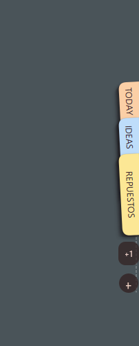
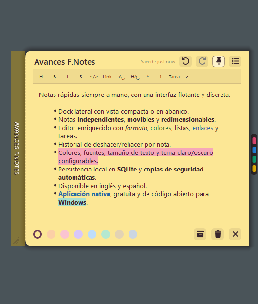

# Floating Notes

[English](README.md) | [Español](README.es.md)

Floating Notes es una utilidad nativa de escritorio para mantener notas locales cerca del borde de la pantalla. Está diseñada para ser liviana, iniciar rápidamente y funcionar completamente sin conexión.

## Ejecutar en Windows

El archivo de lanzamiento `FloatingNotes.7z` contiene la aplicación portable completa, incluido el ejecutable y los archivos de runtime necesarios.

1. Instalá [7-Zip](https://www.7-zip.org/) si todavía no está disponible.
2. Descomprimí `FloatingNotes.7z` en `C:\FloatingNotes` o en cualquier carpeta que prefieras.
3. Abrí la carpeta descomprimida y ejecutá `FloatingNotes.exe`.

No se requiere instalación. Mantené todos los archivos descomprimidos juntos en la misma carpeta mientras uses la aplicación.

## Características actuales

- Dock flotante en el borde de la pantalla principal.
- Indicador de notas compacto y panel de notas en modo abanico.
- Notas editables con guardado local automático.
- Persistencia SQLite mediante Qt SQL.
- Colores, etiquetas, archivado, eliminación y deshacer eliminación de notas.
- Modo Pin para mantener una nota abierta y visible.
- Ventana Todas las notas con búsqueda y filtros.
- Importación y exportación en texto plano, Markdown y archivos `.fnotes`.
- Controles de bandeja del sistema, configuración, inicio con Windows y hotkeys globales.
- Opciones de tema claro, oscuro y del sistema.

## Capturas de pantalla

### Dock en reposo


### Panel en abanico



### Editor de notas



## Requisitos

- Compilador compatible con C++20.
- Qt 6.11 o posterior con los módulos `Widgets` y `Sql`.
- CMake 3.30 o posterior.
- Ninja.

El objetivo actual de desarrollo es Windows 10/11 x64 con MinGW. La aplicación utiliza APIs de Qt para la interfaz y el almacenamiento, por lo que mantiene la posibilidad de portarla a Linux.

## Compilación

Configurá Qt mediante el kit de Qt Creator, el entorno o una configuración local de CMake. El repositorio no contiene rutas específicas de ninguna máquina.

```powershell
cmake -S . -B build -G Ninja
cmake --build build
```

En Windows, el ejecutable se genera en `build/FloatingNotes.exe`.

## Paquete portable para Windows

El repositorio incluye un script de PowerShell que compila un ejecutable Release y crea una carpeta autocontenida para Windows con las DLL necesarias de Qt, el controlador SQLite y el runtime de MinGW.

```powershell
.\scripts\package-portable.ps1 -QtPrefix <path-to-Qt-mingw-kit>
```

Por ejemplo, `<path-to-Qt-mingw-kit>` es la carpeta del kit Qt que contiene `bin/windeployqt.exe`.

Al finalizar el script, la aplicación portable lista para distribuir está en `dist/FloatingNotes/`. Conservá todo el contenido de esa carpeta junto al copiarla a otra computadora con Windows, o comprimila como ZIP para distribuirla. El directorio `dist/` se genera localmente y está excluido de Git.

### Regenerar `dist/`

1. Abrí una terminal de PowerShell donde CMake, Ninja y el compilador MinGW del kit Qt seleccionado estén disponibles en `PATH`.
2. Desde la raíz del repositorio, eliminá o mové la carpeta anterior `dist/FloatingNotes/`. El script de empaquetado no sobrescribe un paquete existente.
3. Ejecutá el script de empaquetado con la ruta del kit Qt MinGW:

```powershell
.\scripts\package-portable.ps1 -QtPrefix <path-to-Qt-mingw-kit>
```

4. Distribuí la nueva carpeta `dist/FloatingNotes/` sin modificar, o creá un ZIP que la contenga.

## Estructura del proyecto

```text
src/
|-- app/          Ciclo de vida, configuración, importación/exportación
|-- core/         Modelo de datos de notas
|-- persistence/  Almacenamiento SQLite
|-- platform/     Integración de escritorio aislada por plataforma
`-- ui/           Ventanas y controles de Qt Widgets
```

## Datos

Las notas se almacenan localmente mediante `QStandardPaths::AppDataLocation`. Floating Notes no requiere una cuenta, acceso a red, telemetría ni servicios en la nube.

## Licencia

El código fuente de Floating Notes se publica bajo la [licencia MIT](LICENSE).

Qt es una dependencia independiente y no está cubierto por la licencia MIT de este repositorio. Al distribuir builds, cumplí con la licencia de Qt elegida para los binarios utilizados.
